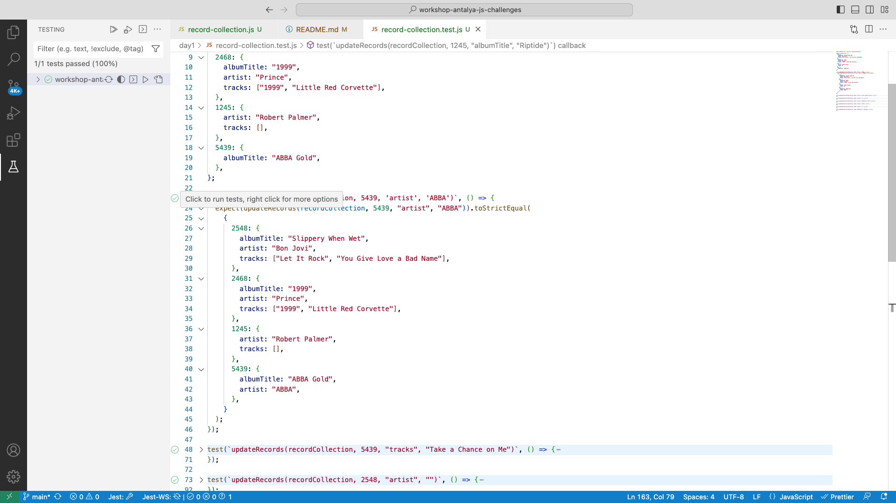

# Workshop Antalya JS Challenges

## How to run the test

1. Clone the repo
2. Run `npm install` in the `workshop-antalya-js-challenges/` folder
3. If you are using VS Code install Jest extension
4. Run test using tests runner from the `record-collection.test.js` file

5. You can also run tests from terminal (if you are on windows install git bash) using `npm run test` command